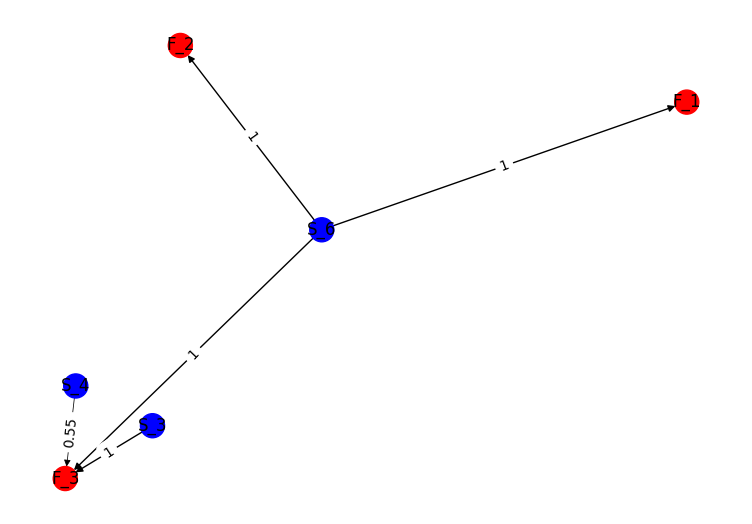

# Knowladge-Based Fault Detection

## Config

Define set of sensor/metrics for which your system collects data in the `config/sensors.yaml`. The format should be as follows:

```yaml
sensors:
    sensor_name:
        id: number
        high: number
        low: number
    ...
```

Then for each possible fault in your system define his own 'Fault Card' in `config/faults.yaml`.
Each faults can have different symptoms and reasons. The format should be as follows:

```yaml
faults:
  - id: number
    name: string
    symptoms:
      - sensor_id: number
        value: low | high | ok
      - ...
    reasons:
      - name: string
        action: string
      - ...
  - ...
```

You have to provide proper config for mqtt connection as well. Put it in the `config/config.yaml`.
The format should be as follows:

```yaml
mqtt_info:
  client_id: id-1001
  username: admin
  password: admin
  broker: localhost
  port: 1883
```

## Examples

An example of knowledge graph:


An example of fault detection graph:


